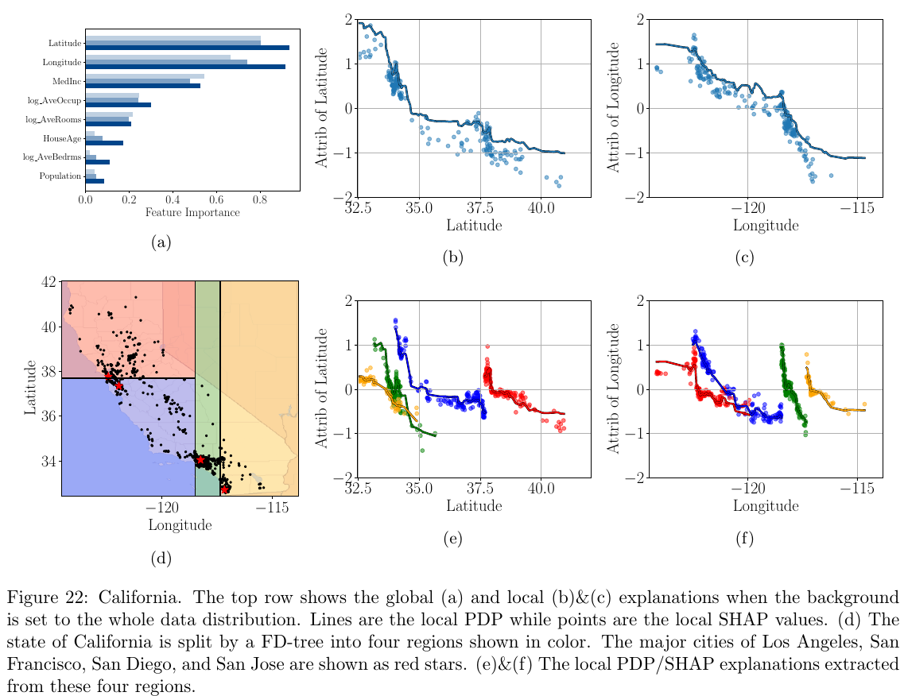

# Tackling the XAI Disagreement Problem with Regional Explanations

## Description

The goal of this repository is to discover **regions** of the input space with reduced
feature interactions. These regions are idenfied as the leaves of a binary decision
tree that is trained to minimize feature interactions As a result, post-hoc explainers
such as PDP and SHAP increase in agreement when restricted to each region.



## Installation

To create the conda environment run

```sh
conda env create --file environment.yml
conda activate FDTrees
```

The code relies on a C++ implementation of the Interventional TreeSHAP algorithm to
efficiently compute Shapley Values, Shapley Taylor Indices, and the $\bm{H}$ tensor from the paper.
To compile the C++ code, run

```sh
python3 setup.py build
```

If everything worked well, you should see a `.so` file in a new `build` directory.

## Experiments

### Toy Experiments

The script that start with `0_*` are toy experiments meant to illustrate how FD-Trees work.
These script can be run directly without providing arguments.

- `0_0_motivation.py` The first toy example in the paper (the piece-wise linear function 
with two regions)
- `0_1_illustration.py` The code to reproduce Figure 2.
- `0_2_interactions.py` A 2D example where we visualize interactions.
- `0_3_correlations.py` A simple example where we investigate correlated features.
- `0_4_gadget_pdp.py` Toy example to convey the intuition behind GADGET-PDP.

### Real Datasets

The remaining script are numbered `1_*` (model training), `2_*` (interaction detection),
`3_*` (regional explanations computations), and `4_*` (plot results).
The reproduce our results, run the following bash scripts

**Model Training** ``./script_train.sh``

**Regional Explanations** ``./script_explain.sh <seed>`` with `<seed>` taking values 0, 1, 2, 3, 4.

**Stability of the Partitions** ``./script_stability.sh``

Finally, the results of the paper are plotted via

- `4_0_plot_california.py` Plot the figures from **Section D.3.4**.
- `4_1_plot_disagreements.py` Plot Figure 3 and Table 2 showing the explanation disagreements.
- `4_2_partition_stability.py` Plot the Figures in **Section D.1** regarding the stability of the partitions w.r.t the subsample size.
